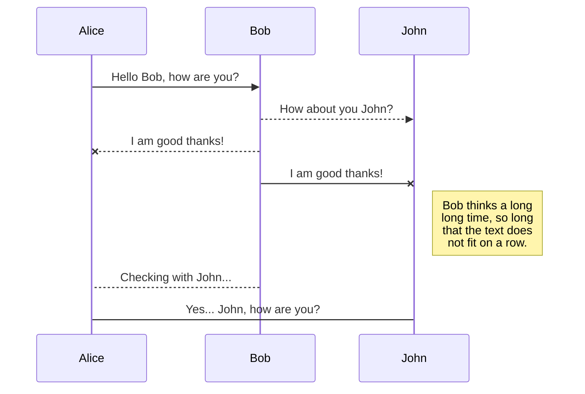
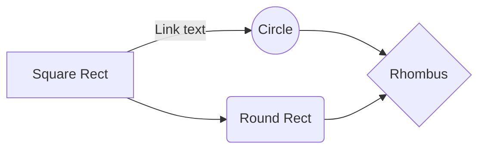

# Study of "C++11/Markdown Doc File"
## Index
* [explicit](#explicit)
* [using エイリアステンプレート](#using-エイリアステンプレート)
* [ビャーネ・ストラウストラップのプログラミング言語c\+\+第3版](#ビャーネ・ストラウストラップのプログラミング言語c\+\+第3版)
* [lambda expression ラムダ式 無名関数](#lambda-expression-ラムダ式-無名関数)
* [operator オペレータ 演算子のオーバーロード](#operator-オペレータ-演算子のオーバーロード)

## explicit
 - 2016/06/29
 - 値渡しでコンストラクタを呼ばれないようにするには, コンストラクタの宣言にexplicitをつける.
 - 参考URL : [ロベールのC++教室第27章](http://www7b.biglobe.ne.jp/~robe/cpphtml/html02/cpp02027.html)
```cpp
class CIntArray{
public:
    explicit CIntArray(const int nNumOf);
};
```

## using エイリアステンプレート
 - 2016/06/29
 - C\+\+11では, クラステンプレートを使って型の別名を定義することができる. この機能は, エイリアステンプレートと呼ばれる.
 - 参考URL: [C++編 言語解説 第20章 クラステンプレート](http://ppp-lab.sakura.ne.jp/ProgrammingPlacePlus/cpp/language/020.html)
```cpp
#include <iostream>
#include <utility>
　
template <typename SECOND_TYPE>
using Pair = std::pair<int, SECOND_TYPE>
　
int main(){
	Pair<const char*> pair(10, "abc");
	std::cout << pair.first << ", " << pair.second << std::endl;
}
```

## ビャーネ・ストラウストラップのプログラミング言語c\+\+第3版
 - 2016/06/29
 - define定数は使うべきではない. 使いたいときはconstかenumを用いる.
 - 関数呼び出しのオーバーヘッドをさけるときにはinlineを用いる.
 - 名前の衝突を避けたいときにはnamespaceを使う.
 - Mallocは使わずnewを使う.
 - 明示的な型変換を使わない.
 - 配列やCスタイルの文字列は避けて, StringやVectorを用いる.
 - 最適化効果が大きい場合を除き, インライン関数を使うな.
 - コンテナに要素を追加するときはpush_back()かback_inserter()を使え.
 - main()で共通例外をキャッチせよ.
 - コードの中にマジックナンバーを埋め込むな. 代わりにシンボル定数を定義して使え.
 - 明示的なキャストを避けよ. 必要な場合はCスタイルのキャストではなく, キャスト演算子を使え.
 - クラス宣言の中で整数定数を定義しなければならないときは列挙型を使え.

## lambda expression ラムダ式 無名関数
 - 2016/06/29
 - その場で簡易的な関数を定義できる. あまり処理の長いラムダ式を書くべきではない.
 - 以下に基本的な使いかた.
```cpp
#include <iostream>
template<typename Func>
void f(Func func){
        func();
}
int main(int argc, char *argv[]) {
	[]	// ラムダキャプチャー
	()	// パラメータ定義節
	{}	// 複合ステートメント
	()	// 関数呼び出し式
	;
　
	[]{ std::cout<<"Hello World"<<std::endl;}();
　
	auto func = []{ std::cout<<"Hello world"<<std::endl;};
    func ();//ラムダ式の呼び出し
　
	f( []{ std::cout<<"Hello world"<<std::endl;} );
　
	[](string const & str) // 引数の定義
        {       // 関数本体
                cout << str << endl;
        }
        ( "I am Argument!");    // 関数呼び出しと引数
　
	auto a = [] { return 0;} (); // 戻り値を推測させる
    auto b = [] () -> float { return 3.14; } (); //明示的に戻り値を定義
    std::cout << a << std::endl;
    std::cout << b << std::endl;
　
	return 0;
}
```
 - ラムダキャプチャーの使い方. 式が定義される関数のスコープの変数をキャプチャできる.
 - 変数ごとにキャプチャの方法（コピーか参照か）を指定できる. mutableを使えばコピーの値を変更できる(その場だけ).
```cpp
#include <iostream>
#include <string>
int main(int argc, char const* argv[]){
	string x = "I am string";
	[&] { std::cout << x << std::endl; } (); //参照
	[=] { std::cout << x << std::endl; } (); //コピー
	[&] { x = "Overwrite s1!"; } (); //参照で上書き
　
	int a = 0, b = 0;
	[a, &b] () mutable { a = 1; b = 1; } ();
	std::cout << a << std::endl; //0
	std::cout << b << std::endl; //1
　
	int a = 0, b = 0, c = 0, d = 0;
	// a,bを参照、それ以外はコピー
	[=, &a, &b] () mutable { } ();
	// a,bはコピー、それ以外は参照
	[&, a, b] () mutable { } ();
　
	return 0;
}
```
 - thisはポインタであるため, キャプチャがコピーでも参照でも, iは, 上書きできる.
```cpp
struct S {
	int i;
	void f() {
		[=]{this->i = 1;}();
    }
};
int main(int argc, char const* argv[]){
        S s;
        s.f();
        return 0;
}
```
 - std::functionを使用することでラムダ式を関数から返すことができる.
```cpp
#include <iostream>
#include <string>
#include <functional>
std::function< void() > f() {
        string str("Hoge");
        return [=] { std::cout << str << std::endl; };
}
int main(int argc, char const* argv[]){
	auto func = f();
	func();	// 代入して呼び出し
	f()();	// 代入せずに、呼び出し
	return 0;
}
```
 - 参考URL : [C++入門 ラムダ式](http://kaworu.jpn.org/cpp/%E3%83%A9%E3%83%A0%E3%83%80%E5%BC%8F)

## operator オペレータ 演算子のオーバーロード
 - 2016/06/30

* * *
## MarkDown記法のサンプル (Haroopadでしか動作しないかも)
$$
r^2 = x^2 + y
$$




