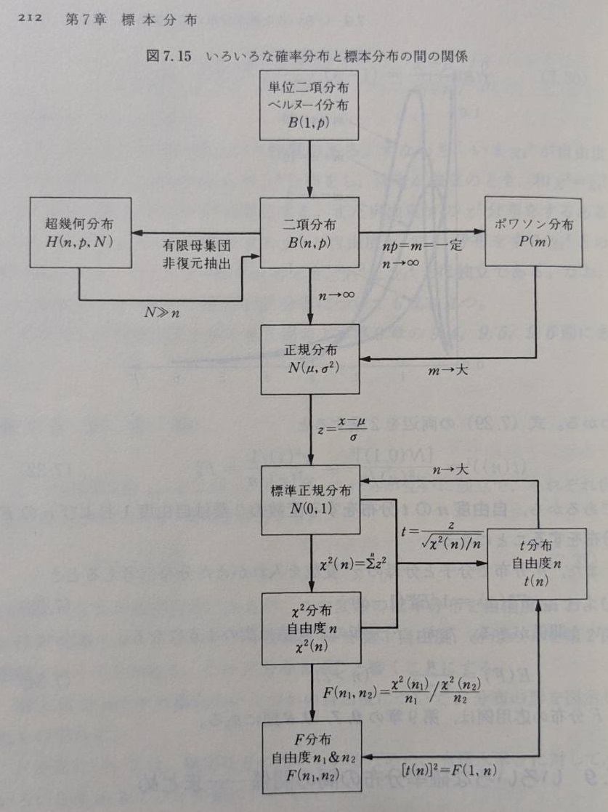

# 基本統計学 第5版 宮川公男

## 序章

### 0.1 統計と人間生活
24-07-04 DONE 100%

### 0.2 統計とその働き
24-07-04 DONE 100%

### 0.3 いくつかの基礎的概念
* 統計的推論: 少ない標本で母集団の性質を推測すること -> 統計的推定
* 統計的記述: 数回の標本の結果そのものだけの性質を分析すること
* 統計的検定: 母集団の性質についての仮定を標本について調べた結果から判定すること

24-07-04 DONE 100%

## 第1章 平均値と分散

### 1.1 平均値 - 代表値
いろいろな平均があるが基本は算術平均 (算術平均, 幾何平均, 調和平均, 絶対平均)
24-07-04 DONE 100%

### 1.2 算術平均 - 最も代表的な平均値
* 算術平均からの偏差の和は常に0である

$$
\sum_{i=1}^n (x_i - \bar{x} ) = 0
$$

24-07-04 DONE 100%

### 1.3 加重平均
重み付きの算術平均のこと
24-07-04 DONE 100%

### 1.4 分散度 - 散らばりの尺度
24-07-04 DONE 100%

### 1.5 範囲と四分位偏差
四分位偏差はデータ数を4等分する一のデータQ1, Q2(中央値), Q3を用いて以下で計算. 分散の仲間. 

$$
QD = \frac{Q_3-Q_1}{2}
$$

24-07-04 DONE 100%

### 1.6 平均絶対偏差
24-07-04 DONE 100%

### 1.7 標準偏差と分散 - 最も重要な分散度

標準偏差sの二乗 = 分散s2

$$
s = \sqrt{\frac{1}{n} \sum_{i=1}^n (x_i - \bar{x} )^2}
$$

$$
s^2 = \frac{1}{n} \sum_{i=1}^n (x_i - \bar{x} )^2
$$

24-07-04 DONE 100%

### 1.8 標準偏差(分散)の性質

* データの一次変換 $y_i=ax_i+b$によって分散は $s_y^2 = a^2 s_x^2$
* 分散を求める暗記すべき公式が以下, 分散の定義を式変形すれば求まる.  

$$
s^2 = \frac{1}{n} \sum_{i=n}^2 x^2 - \bar{x}^2
$$

24-07-04 DONE 100%

### 1.9 標準変化量と偏差値
以下の標準化変量z (標準偏差の何倍離れているか)を求めればあるデータが全体の中のどれくらいの位置にあるかわかる, 偏差値は $50+10z$ で求まる値. 

$$
z = \frac{x-\bar{x}}{s}
$$

24-07-04 DONE 100%

### 1.10 変異係数
変異係数CV(coefficient of variant).  平均値によってばらつきを正規化する.  

$$
CV = \frac{s}{\bar{x}}
$$

24-07-04 DONE 100%

## 第2章 度数分布

### 2.1 度数分布とは
24-07-05 DONE 100%

### 2.2 度数分布の作り方
24-07-05 DONE 100%

### 2.3 度数分布のグラフ
24-07-05 DONE 100%

### 2.4 相対度数分布
24-07-05 DONE 100%

### 2.5 累積度数分布
24-07-05 DONE 100%

### 2.6 度数分布からの平均値・分散の計算
24-07-05 DONE 100%

## 第3章 回帰と相関の分析

### 3.1 回帰関係の意味
線形回帰: データ $x_i$ と $y_i$ が与えられたときに条件付き平均値 $\bar{y}_x =a+bx$ のパラメータ $a,b$を最小二乗法と正規方程式で求めること. 

24-07-05 DONE 100%

### 3.2 回帰関係の計算
以下の $S$ を最小化するように $a,b$ を決める. (最小二乗法)

$$
S(a,b) = \sum_{i=1}^n [y_i - (a+b x_i)]^2
$$

$a,b$ でそれぞれ偏微分=0で以下を得る. (正規方程式)
二つの式は覚えて計算できるようになるとともに意味を理解する(偏差の合計は0, 偏差と回帰変数xは直交する(モーメント0))

$$
\sum_i e_i=0 \Rightarrow na + b \sum_i x_i = \sum_i y_i
$$

$$
\sum_i e_i x_i=0 \Rightarrow a\sum_i x_i + b \sum_i x_i^2 = \sum_i x_i y_i
$$

問題では $x, y$ の表が与えられるため $x,y,xy$ とそれぞれの二乗の合計を計算しておき利用する. 

24-07-05 DONE 100%

### 3.3 決定係数と相関係数
関係があるデータ $x_i,y_i$ が与えられたときに、単純な $y$ の分散 $s_y^2$ ではなく以下のようにxの影響を差し引いた分散 $s_{y \cdot x}^2$を考える. 単純な分散よりも小さくなる. 

$$
s_{y \cdot x}^2= \frac{1}{n} \sum_{i=1}^n [y_i - (a+b x_i)]^2
$$

$s_r^2=s_y^2 - s_{y \cdot x}^2$ としたときに $r^2$ を以下とすると $r^2$ は $y$ の分散の内 $x$ によって説明される部分の割合を示す.  ( $r^2$ は決定係数, $r$ は相関係数と呼ばれる)

$$
r^2 = \frac{s_r^2}{s_y^2}
$$

$r^2$ は0~1の値をとって0に近ければ $x$ と $y$ は関係が無く, 1に近ければ $x$ と $y$ は関係が強い. 
決定係数を計算するには定義式から以下のように $s_{y \cdot x}^2$ を計算すればいい

$$
s_{y \cdot x}^2= \frac{1}{n} \{ \sum_i y_i^2 - ( a \sum_i y_i + b \sum_i x_i y_i)  \}
$$

以下のような共分散 $s_{xy}$ を考えると正規方程式から以下関係が出る. 

$$
s_{xy} = \frac{1}{n} \sum (x-\bar{x}) (y-\bar{y})
$$

$$
r^2 = \frac{s_{xy}^2}{s_x^2 s_y^2}
$$

24-07-05 DONE 100%

### 3.4 重回帰
24-07-05 DONE 100%

### 3.5 重決定係数と重相関係数
24-07-05 DONE 100%

### 3.6 相関係数と相関係数
共分散 $s_{xy}$ の意味を考えると, データが $\bar{x}, \bar{y}$ を原点として第1象限～第4象限のどこに多いかというように考えられる.  第1,3象限に入るデータが多い=値は正になる, 第2,4象限に入るデータが多い=値は負になる.

$x$ と $y$ の標準変化量 $z$ の共分散が相関係数 $r$

$$
\frac{1}{n} \sum \frac{(x-\bar{x})}{s_x} \frac{(y-\bar{y})}{s_y} = \frac{s_{xy}}{s_x s_y} = r
$$

共分散を計算する公式

$$
s_{xy} = \frac{1}{n} \sum xy - \bar{x} \bar{y}
$$

24-07-05 DONE 100%

### 3.7 順位相関係数
24-07-05 DONE 100%

## 第4章 確率

### 4.1 順列と組合せ
順列の定義

$$
{}_n P_r = n (n-1) \dots (n-r+1) = \frac{n!}{(n-r)!}
$$

組合せの定義

$$
{}_n C_r = \frac{{}_n P_r}{r!}
$$

24-07-05 DONE 100%

### 4.2 確率
24-07-05 DONE 100%

### 4.3 標本空間
事象=標本点を座標軸に並べたものが標本空間

24-07-05 DONE 100%

### 4.4 標本点と確率
標本空間 $S$ に関して $P \{ S\} =1$ ,全ての事象の確立の和は1. 

24-07-05 DONE 100%

### 4.5 加法定理
ただの集合の和の話

24-07-05 DONE 100%

### 4.6 条件付き確立と乗法定理
事象 $A_1,A_2$ が両方起きる確率は以下で表される. 
ただし $P \{ A_2 | A_1\}$ は $A_1$ が起こった条件での $A_2$が起きる確率. 式だけ見ると当たり前.
$A_1,A_2$ が独立している場合はただの掛け算になる. 

$$
P \{ A_1 A_2 \} = P \{ A_1 \} P \{ A_2 | A_1\}
$$

24-07-05 DONE 100%

### 4.7 ベイズの定理とベイジアン理論
条件付き確立を利用して結果条件とする原因の確立を求めることをベイジアン理論という.
以下がベイズの定理.  ( $B_k$ は原因の候補, $A$ は結果)

$$
P \{ B_k | A \} = \frac{P \{ A B_k \}}{P \{ A \} }
$$

24-07-05 DONE 50% 理解は完ぺきではないがQC検定には関係ないから次に進める. 

## 第5章 確率変数と確率分布

### 5.1 確率変数
ある標本空間の標本点に対応して決まるようような変数を確率変数 $x$ という.  
確率変数とは, その取りうる各値に対してそれぞれある一定の確率 $P(x)$ が付与されているような変数.

24-07-05 DONE 100%

### 5.2 確率分布
関数としての $P(x)$ を確率分布関するまたは確率分布という. (離散値の場合)

確率変数が連続の場合は確率分布で表せないので確率密度関数 $f(x)$ を用いて $P(x)$ を定義する

$$
P(a < x < b) = \int_a^bf(x)dx
$$

24-07-05 DONE 100%

### 5.3 期待値
確率変数 $x$ の平均値のことを期待値 $E(x), \mu$ という. 特に確率の考えが入ってるときに平均値ではなく期待値と呼ぶ.

$x$ が離散確率変数の場合:

$$E(x) = \mu = \sum_x x P(x)$$

$x$ が連続確率変数の場合:

$$E(x) = \mu = \int_{\infty}^{\infty} x f(x) dx$$

$x$ のある関数 $u(x)$ の期待値

$$E[u(x)] = \sum_x u(x)P(x) $$

$$E[u(x)] = \int_{\infty}^{\infty} u(x) f(x) dx$$

24-07-05 DONE 100%

### 5.4 分散
期待値からの偏差の二乗の期待値を分散という.  
$$ V(x) = \sigma^2 = E[(x-\mu)^2] $$

離散値の場合:
$$\sigma^2 = \sum_x (x-\mu)^2 P(x)$$ 

連続値の場合:
$$\sigma^2 = \int_{\infty}^{\infty} (x-\mu)^2 f(x) dx$$  

計算するための公式：
$$ \sigma^2 = E(x^2) - \mu^2 $$

24-07-05 DONE 100%

### 5.5 積率
n次モーメント(平均や分散の一般化)の話
$x^k$ の期待値、$(x-\mu)^k$ の期待値をそれぞれ原点積率, 積率といい以下で表す.

$$ \mu_k' = E(x^k) = \sum_x x^k P(x) $$
$$ \mu_k = E[(x-\mu)^k] = \sum_x (x-\mu)^k P(x) $$

1次の原点積率は平均, 2字の積率は分散. 確率変数 $x$ が連続値の場合は $f(x)$ と積分で表す. 

24-07-08 100% DONE

### 5.6 積率母関数
以下を確率変数 $x$ の積率母関数といい, 積率を効率的に計算するために使われる.  $\theta$ は計算のため便宜上のパラメータで意味はなし. 

$$ M_x(\theta) = \sum_x e^{\theta x} P(x) $$

$e^x$ のテイラー展開から以下に式変形できる.

$$ M_x(\theta) = 1 + \theta \mu_1' + \frac{\theta^2}{2!}\mu_2' + \frac{\theta^3}{3!}\mu_3'  +\dots $$

よってこれをk階微分して $\theta = 0$ にすればk次の原点積率が得られる.

$$ \frac{d^k M_x(\theta)}{d \theta^k} |_{\theta=0} = \mu_k' $$

24-07-08 100% DONE

### 5.7 2変数の確率分布
24-07-08 20% QC検定には関係ないからさらっと読んでいったん終わり. 

### 5.8 共分散と相関係数
期待値 $E$ を用いて共分散と相関係数を改めて定義する. 

$$ Cov(x,y) = E[(x-E(x))(y-E(y))] = \sigma_{xy} $$

計算すると以下になり, xとyが独立なら0になることがわかる.

$$
\begin{align*}
Cov(x,y) & = E[(x-E(x)(y-E(y)))]  \\
        & = E(xy) - E[xE(y)] - E[E(x)y] + E(x)E(y) \\
        & = E(xy) - E(x)E(y) - E(y)E(x) + E(x)E(y) \\
        & = E(xy) - E(x)E(y)
\end{align*}
$$

$x+y$ の分散を計算すると以下になる. よって各分散の和に共分散の2倍が足される(相乗効果的な)

$$
\begin{align*}
V(x+y) & = E[ \{ x+y - E(x+y) \}^2]  \\
        & = E[ \{ x - E(x) + y-E(y) \}^2] \\
        & = E[ \{ x - E(x) \}^2 ] + E[ \{ y - E(y) \}^2 ] + 2E[(x-E(x)(y-E(y)))] \\
        & = V(x) + V(y) + 2Cov(x,y)
\end{align*}
$$

相関係数も期待値を使って以下定義する. 
以下式から相関係数は標準変化量の共分散である. 

$$
\begin{align*}
\rho (x+y) & = E[ ( \frac{x-E(x)}{\sigma_x} ) (\frac{y-E(y)}{\sigma_y}) ]  \\
        & = \frac{Cov(x,y)}{\sqrt{V(x)} \sqrt{V(y)}} \\
        & = \frac{\sigma_{xy}}{\sigma_x \sigma_y}
\end{align*}
$$

24-07-08 100% DONE

## 第6章 主な確率分布

### 6.1 二項分布
確率 $p$ で起こる事象を $n$ 会繰り返した時に $x$ 会起こる確率は以下で表され, これを二項分布という. 
ほぼ定義通りの式. ( $q=1-p$ )

$$ P(x) = P(x; n,p) = B(n,p)= {}_n C_x p^x q^{n-x} = \frac{n!}{x! (n-x)! } p^x (1-p)^{n-x}$$

二項分布の名前の由来は以下 $(p+q)^n$ の一般項の式から来る.

$$
\begin{align*}
(p+q)^n & =  {}_n C_0 p^0 q^n + {}_n C_1 p^1 q^{n-1} + {}_n C_2 p^2 q^{n-2} + \dots + {}_n C_n p^n q^0 \\
        & = \sum_{x=0}^n {}_n C_x p^x q^{n-x} = \sum_{x=0}^n P(x) = 1
\end{align*}
$$

二項分布の平均値は $np$ , 分散は $npq$, 標準偏差は $\sqrt{npq}$ である. 

#### 二項分布の平均値 $np$ の証明
$y=x-1$ として定義通り計算すると上記の一般項の和の形にできる(=1).

$$
\begin{align*}
\mu & = E(x) = \sum_{x=0}^n x P(x) \\
        & = \sum_{x=0}^n x {}_n C_x p^x q^{n-x} \\
        & = np \sum_{y=0}^{n-1} {}_{n-1} C_y p^y q^{n-1-y} \\
        & = np
\end{align*}
$$

分散についても似たような一般項の和の形に持っていくことで $npq$ が導出できる.
また積率母関数を使えばアイデア無しで計算のみで導出できる.   

24-07-08 80% DONE (分散の導出は覚えない)

### 6.2 ポワソン分布
二項分布はnが大きくなると計算が大変になる. nが非常に大きい場合に簡単に計算するため以下二つの近似法がある.

* nが非常に大きいかつpが非常に小さい -> ポワソン分布
* nが非常に大きいかつpが小さくない -> 正規分布

平均値 $np = m$ を固定して二項分布の $n \rightarrow \infty$ とするとポアソン分布が導出できる

$$
\begin{align*}
P(x) & = {}_n C_x p^x q^{n-x} = \frac{n!}{x! (n-x)! } p^x (1-p)^{n-x}\\
        & = \frac{n(n-1)(n-2)(n-3) \dots (n-x+1)}{x!} p^x (1-p)^{n-x} \\
        & = \frac{n(n-1)(n-2)(n-3) \dots (n-x+1)}{n^x x!} (np)^x (1-p)^{n-x} \\
        & = \frac{(1-\frac{1}{n})(1-\frac{2}{n}) \dots (1-\frac{x-1}{n})}{(1-p)^x} \frac{m^x}{x!} (1-p)^{n}
\end{align*}
$$

$$
\begin{align*}
\lim_{n\to \infty}P(x) & = \lim_{n\to \infty} \frac{(1-\frac{1}{n})(1-\frac{2}{n}) \dots (1-\frac{x-1}{n})}{(1-p)^x} \frac{m^x}{x!} (1-p)^{n}\\
        & = 1 \cdot \frac{m^x}{x!} \lim_{p\to 0} [(1-p)^{-\frac{1}{p}}]^{-m} \\
        & = \frac{m^x e^{-m}}{x!}
\end{align*}
$$

おおよそnが100以上, pが0.05以下でポアソン分布に十分よく近似できる.

ポアソン分布の平均値は $m=np$ , 分散も $m=np$ . 
二項分布の平均値、分散の極限を取ればわかる. 

24-07-08 100% DONE

### 6.3 超幾何分布
二項分布に対して, 各事象が独立していない場合の分布 (52枚のトランプから10枚カードを引いたときのハートの枚数等)を超幾何分布という. 

24-07-08 20% DONE QC検定2級では不要のためスキップ

### 6.4 矩形分布
確率密度関数が一定の分布. 

24-07-08 100% DONE

### 6.5 正規分布
以下の分布, 平均値 $\mu$ , 分散 $\sigma^2$ .

$$ f(x) = N(\mu,\sigma^2)= \frac{1}{\sqrt{2\pi}\sigma}e^{-\frac{(x-\mu)^2}{2\sigma^2}}$$

導出が記載されていないのが残念. 

24-07-08 100% DONE

## 第7章 標本分布

### 7.1 母集団と標本
24-07-08 100% DONE

### 7.2 母集団特性値と標本統計量
* 標本統計量: 標本比率 $ \hat{p}$ のように母集団の特性値について推測するために標本から求められるもの
  * 母集団の特性 $p$ は一定値だが標本統計量 $\hat{p}$ は標本変動のため一定ではない
  * よって標本統計量は確率変数である. この確率分布を標本分布という.
  * 標本統計量には対応する確率モデル(二項分布等)で誤差を見積もることができる

24-07-08 100% DONE

### 7.3 標本比率 $\hat{p}$ の標本分布
母集団がp:1-pの割合でA, Bのグループに分かれるときに, そこからnの標本を無作為に選ぶ場合にAグループに属するもの数をxとするとxは二項分布に従うよって標本比率 $\hat{p}$ の平均, 分散は以下で計算できる.

$$ E(\hat{p}) = E(\frac{x}{n}) = \frac{np}{p} = p $$

$$ V(\hat{p}) = \frac{1}{n^2}V(x) = \frac{pq}{n} $$

nが大きい場合には $\hat{p}$ の標本分布は正規分布 $N(p,\frac{pq}{n})$ になるため以下標準変化量zは標準正規分布に従う

$$ z = \frac{\hat{p}-p}{\sqrt{pq/n}} $$

24-07-08 100% DONE

### 7.4 標本平均値 $\bar{x}$ の標本分布 - 平均値と分散
平均値 $\mu$ ,分散 $\sigma^2$ の母集団から取られた大きさ $n$ の標本の平均値 $\bar{x}$ の期待値は $\mu$ , 分散は $\sigma^2 / n$ である.

$$
\begin{align*}
E(\bar{x}) & = E[\frac{1}{n} (x_1 + x_2 + \dots + x_n)] \\
        & = \frac{1}{n} [E(x_1) + E(x_2) + \dots + E(x_n) ] \\
        & = \mu
\end{align*}
$$

$$
\begin{align*}
V(\bar{x}) & = V[\frac{1}{n} (x_1 + x_2 + \dots + x_n)] \\
        & = \frac{1}{n^2} [E(x_1) + E(x_2) + \dots + E(x_n) ] \\
        & = \sigma^2 / n
\end{align*}
$$

24-07-08 100% DONE

### 7.5 $\bar{x}$ の標本分布 - 中心極限定理
7.4では母集団が従う分布について述べなかったが中心極限定理によってnが大きい場合は母集団は正規分布 $N(\mu, \sigma^2/n)$ に近づくため, 以下標準変化量zは標準正規分布に従う.

$$ z = \frac{\bar{x} - \mu}{\sigma / \sqrt{n}} $$

24-07-08 100% DONE

### 7.6 $t$ 分布
平均値に関しては母集団の $\sigma^2$ が既知であれば標準正規分布表から以下のように推定できる.
ここで $N(0,1)$ に従う変数が-1.96から1.96の範囲にある確率は95%である.  

$$ P_r \{ -1.96 <  \frac{\bar{x} - \mu}{\sigma / \sqrt{n}  } < 1.96\} = 0.95 $$

これを $\mu$ について解けば以下になる.

$$ \bar{x} -1.96 \frac{\sigma}{\sqrt{n}} < \mu < \bar{x} +1.96 \frac{\sigma}{\sqrt{n}} $$

しかしほとんどの場合 $\sigma^2$ も未知であるため推定値を考える. 
推定値は以下の標本分散 $\hat{\sigma}^2$ を使う. nではなくn-1で割る.

$$ \hat{\sigma}^2 = \frac{1}{n-1} \sum_{i=1}^n (x_i - \bar{x})^2 $$

これを使った以下の式tは自由度n-1のt分布に従う.

$$ t = \frac{\bar{x}-\mu}{\hat{\sigma}/\sqrt{n}} $$

#### $\hat{\sigma}^2$ が $\sigma^2$ の推定値としてふさわしい理由
以下の期待値を計算すると $\hat{\sigma}^2$ の期待値が $\sigma^2$ になると分かる.  

$$
\begin{align*}
\sum_i (x_i-\mu)^2 & = \sum_i (x_i - \bar{x} + \bar{x} -\mu) \\
        & = \sum_i (x_i - \bar{x})^2 + \sum_i (\bar{x}-\mu)^2 + \sum_i 2 (x_i - \bar{x})(\bar{x} - \mu) \\
        & = \sum_i (x_i - \bar{x})^2 + n(\bar{x}-\mu)^2 \\
E[\sum_i (x_i-\mu)^2] & = E[ \sum_i(x_i - \bar{x})^2] + nE(\bar{x}-\mu)^2 \\
n\sigma^2 & = E[ \sum_i(x_i - \bar{x})^2] + \sigma^2 \\
E[ \sum_i(x_i - \bar{x})^2] & = (n-1) \sigma^2 \\
E[ \frac{1}{n-1} \sum_i(x_i - \bar{x})^2] & = \sigma^2 \\
E[\hat{\sigma}^2] & = \sigma^2
\end{align*}
$$

#### $t$ 分布の性質
* パラメータはn-1(自由度)のみ
* 0を中心とした左右対称
* 標準正規分布よりもすそ野が広い (ピークが低い)
* nが無限大だと標準正規分布に一致する
* t分布の分散は n/(n-2)
* t分布を用いれば母集団の $\sigma$ の値が分からない場合でも母集団平均値 $\mu$ の推論ができる

$$ P_r \{ -t_{0.025}(n-1) <  \frac{\bar{x} - \mu}{\hat{\sigma} / \sqrt{n}  } < t_{0.025}(n-1)\} = 0.95 $$

$$ \bar{x} -t_{0.025}(n-1) \frac{\hat{\sigma}}{\sqrt{n}} < \mu < \bar{x} +t_{0.025}(n-1) \frac{\hat{\sigma}}{\sqrt{n}} $$

t分布の導出はネットでさらっと見た. 今は放っておいていい.  

24-07-08 100% DONE

### 7.7 標本分散の標本分布と $\chi^2$ 分布
以下で定義される $\chi^2$ は $\chi^2$ 分布に従う.  

* 標準正規分布 $N(0,1)$ からのn個の独立な標本値の平方和が自由度nの $\chi^2$ 分布をする.  
* $\chi^2$ 分布の平均値はn, 分散は2n. 
* 分散の推定に使う.   

$$ \chi^2 = \sum_{i=1}^n (\frac{x_i - \bar{x}}{\sigma})^2 = \frac{(n-1)\hat{\sigma^2}}{\sigma^2} $$

$\chi^2$ 分布と $t$ 分布の関係

$$ t(n) = \frac{N(0,1)}{\sqrt{\chi^2(n)/n}} $$

24-07-08 50% DONE この辺はあまり導出等が書いていないから雰囲気しかわからない.  

### 7.8 $F$ 分布
2つの確率変数 $\chi_1^2, \chi_2^2$ があり, それぞれが互いに独立でそれぞれの自由度がm,nのとき以下の確率変数FはF分布に従う. 

$$ F = F_n^m = \frac{\chi_1^2 /m}{\chi_2^2 /n} $$

F分布とt分布の関係
* 自由度nのt分布をする変数の2条は自由度1およびnのF分布をする

$$ (t(n))^2 = \frac{[N(0,1)]^2}{\chi^2(n)/n} =  \frac{\chi^2(1)/1}{\chi^2(n)/n} = F_n^1 $$

24-07-08 50% DONE ここもはあまり導出等が書いていないから雰囲気しかわからない.  

### 7.9 いろいろな確率分布の間の関係 - まとめ
大事な図.

24-07-08 100% DONE

## 第8章 推定
### 8.1 統計的推論 - 推定と検定
24-07-08 100% DONE

### 8.2 区間推定 - 比率
標本比率 $x/n$ は $x$ が二項分布に従うため平均値 $np/p=p$ , 分散 $npq / n^2 = pq/n$ の正規分布に従う.
よって以下の標準化した変数 $z$ は $N(0,1)$ に従う.

$$ z = \frac{x/n - p}{\sqrt{pq/n}} $$

よって信頼区間を95%とすると以下が成り立つ.

$$ P_r \{ -1.96 <  \frac{x/n - p}{\sqrt{pq/n}} < 1.96\} = 0.95 $$

式変形すると以下の二次不等式が得られる.  

$$ (n+3.84)p^2 - (2x+3.84)p + x^2/n < 0 $$

上記を解けば $p$ の範囲が得られる.  (信頼係数95%のPの信頼区間)

#### 8.2.2 近似計算法
$p$ について正確に解かなくても上式を変形して

$$ P_r \{x/n -1.96 \sqrt{pq/n} <  p < x/n +1.96 \sqrt{pq/n} \} = 0.95 $$

とし, 両辺の $p$ の代わりに $x/n$ を入れて計算しても十分な精度の計算が可能.

24-07-09 100% DONE

### 8.3 区間推定 - 平均値
#### 8.3.1 平均値の区間推定 - 大標本の場合
$\bar{x}$ の平均値は $\mu$ , 分散は $\sigma^2 /n$ のため $n$ が大きい場合は以下標準変化量 $z$ は $N(0,1)$ に従うため95%の信頼区間で以下が成り立つ.

$$ P_r \{ -1.96 <  \frac{\bar{x} - \mu}{\sigma / \sqrt{n}  } < 1.96\} = 0.95 $$

$$ \bar{x} -1.96 \frac{\sigma}{\sqrt{n}} < \mu < \bar{x} +1.96 \frac{\sigma}{\sqrt{n}} $$

母集団の分散がわからない場合は推定値 $\hat{\sigma}^2$ を用いる.
信頼区間99%の場合は以下.

$$ P_r \{ -2.58 <  \frac{\bar{x} - \mu}{\sigma / \sqrt{n}  } < 2.58 \} = 0.99 $$

$$ \bar{x} - 2.58 \frac{\sigma}{\sqrt{n}} < \mu < \bar{x} + 2.58 \frac{\sigma}{\sqrt{n}} $$

24-07-09 100% DONE

#### 8.3.2 平均値の区間推定 - 正規母集団で小標本の場合
$n$ が小さい場合は以下統計量 $t$ を計算すると自由度 $n-1$ の $t$ 分布に従うため $\mu$ は以下のように推定できる. (信頼区間95%)

$$ t = \frac{\bar{x}-\mu}{\hat{\sigma}/\sqrt{n}} $$

$$ P_r \{ -t_{0.025}(n-1) <  \frac{\bar{x} - \mu}{\hat{\sigma} / \sqrt{n}  } < t_{0.025}(n-1)\} = 0.95 $$

$$ \bar{x} -t_{0.025}(n-1) \frac{\hat{\sigma}}{\sqrt{n}} < \mu < \bar{x} +t_{0.025}(n-1) \frac{\hat{\sigma}}{\sqrt{n}} $$

24-07-09 100% DONE

#### 8.3.3 区間推定の実験
24-07-09 100% DONE

### 8.4 標本の大きさの決定
#### 8.4.1 比率の推定と標本の大きさ
比率の推定の誤差 $|x/n-p|$ をある値 $E$ 以内にしたい場合は以下式で $|x/n-p|=E$ として $n$ について解けばいい.

$$ P_r \{ -1.96 <  \frac{x/n - p}{\sqrt{pq/n}} < 1.96\} = 0.95 $$

$$ n = (\frac{1.96}{E})^2 p(1-p) $$

また $p(1-p)$ の最大値は $p=1/2$ の時に $1/4$ のためそこから $n$ を見積もれる.  

24-07-09 100% DONE

#### 8.4.2 平均値の推定と標本の大きさ
同じように考えて平均値の誤差を $E$ 以下に抑えたい場合は $n$ は以下で計算できる. ( $|\bar{x} - \mu|=E$ )

$$ P_r \{ -1.96 <  \frac{\bar{x} - \mu}{\sigma / \sqrt{n}  } < 1.96\} = 0.95 $$

$$ n = (\frac{1.96 \sigma}{E})^2 $$

24-07-09 100% DONE

### 8.5 区間推定 - 分散
以下の標本分散について $C^2$ は修正 $\chi^2$ 分布に従う.  

$$ \hat{\sigma}^2 = \frac{1}{n-1} \sum_{i=1}^n (x_i - \bar{x})^2 $$

$$ C^2 = \frac{\hat{\sigma}^2}{\sigma^2} $$

よって修正 $\chi^2$ 分布を使って下位2.5%, 上位2.5%となる位置 $C_1, C_2$ を求めれば $\sigma^2$ が以下のように推定できる.

$$ P_r \{ C_1^2 <  \frac{\hat{\sigma}^2}{\sigma^2} < C_2^2 \} = 0.95 $$

$$ P_r \{ \frac{\hat{\sigma}^2}{C_2^2} <  \sigma^2 < \frac{\hat{\sigma}^2}{C_1^2} \} = 0.95 $$

24-07-09 100% DONE

### 8.6 点推定
#### 8.6.1 点推定の問題
一般に任意の母集団パラメータ $\theta$ を考え, その推定のために用いられるものを推定量 $\hat{\theta}$ という. $\hat{\theta}$ は確率変数である.  

24-07-09 100% DONE

#### 8.6.2 普遍性
推定量 $\hat{\theta}$ が平均的に真のパラメータ $\theta$ と一致する時, その推定量は不変であるという.

$$ E(\hat{\theta}) = \theta $$

24-07-09 100% DONE

#### 8.6.3 効率
普遍性があっても分散が大きければ意味がないため分散が小さいことを効率がいいという.  

24-07-09 100% DONE

#### 8.6.4 最尤推定法
なるべく効率的な $\hat{\theta}$ を探す代表的な手法が最尤推定法.
具体的には尤度関数 $L(p)$ を考え, 以下を満たす $p$ を $\hat{p}$ とする.
尤度関数を最大にする $p$ が $\hat{p}$ になる.

$$ \frac{dL(p)}{dp} =0$$

24-07-09 20% QC検定2級では関係ないためスキップ, そもそも詳細に記載されていない.  

## 第9章
### 9.1 検定の問題
#### 9.1.1 1つの例題
24-07-09 100% DONE

#### 9.1.2 検定における2種類の誤り

#### 9.1.3 仮説の検定の手続き

#### 9.1.4 2種類の誤りの間の関係

### 9.2 比率の検定
#### 9.2.1 比率の検定

#### 9.2.2 比率の差の検定

### 9.3 平均値の検定
#### 9.3.1 平均値の検定 - 正規分布による場合

#### 9.3.2 平均値の検定 - $t$ 分布による場合

#### 9.3.3 平均値の差の検定

### 9.4 分散の検定 - $\chi^2$ 分布の応用

### 9.5 適合度の検定 - $\chi^2$ 分布の応用

### 9.6 分割表の検定 - $\chi^2$ 分布の応用

### 9.7 分散の同一性の検定 - $F$ 分布の応用

### 9.8 分散分析 - $F$ 分布の応用

## 第10章 回帰の推測統計理論
### 10.1 回帰パラメータの推定量の標本分布

### 10.2 回帰パラメータの区間推定

### 10.3 回帰パラメータの検定と $t$ 値

### 10.4 決定係数・相関係数と自由度調整

### 10.5 計算例

## 終章 統計学の歴史, 因果関係分析, データ・サイエンス
### 11.1 統計学の歴史

### 11.2 因果関係についての考え方

### 11.3 データ・サイエンスと情報の意義